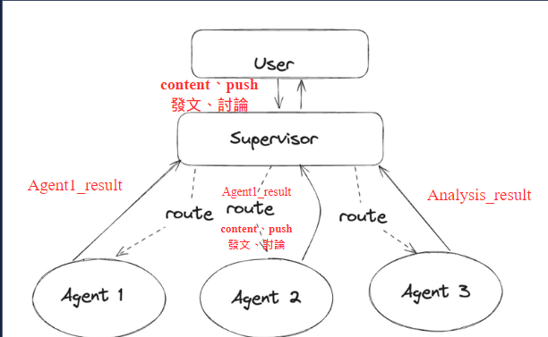
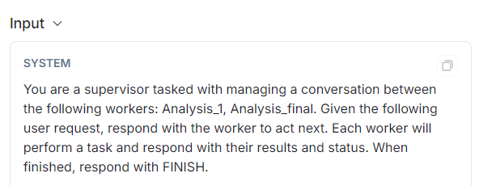

# Sentiment Analysis-langchain
Description

---
langchain-ai/langgraph的方式
---
實作multi_agent-agent_supervisor
---
```
https://github.com/langchain-ai/langgraph/blob/main/examples/multi_agent/agent_supervisor.ipynb
```
### 概念


https://github.com/langchain-ai/langgraph/blob/main/examples/multi_agent/agent_supervisor.ipynb

透過AI-Langchain提供的方式，建立Graph去處理任務流程，可以靈活調動edge

Multi-agent是由多個自主代理（agents）組成的系統，各agent處理特定任務，並相互協作

透過主管代理（supervisor agent）來管理任務進度以及流程，由supervisor管理各agent
### 程式碼
```
pip install langchain-core langchain-openai langchain-community langchain-experimental langchain
```
LangChain 是一個強大的框架，專門用來簡化和擴展自然語言處理（NLP）工作流程。它的主要目標是透過將不同的語言模型、工具和資源整合到一個統一的系統中，幫助開發者輕鬆構建和管理複雜的 NLP 應用。

此外lanchain可與langsmith連接，並透過langsmith追蹤程式的運行流程

(ex. 每個階段input、output)

### langchain_core
處理對話狀態(HumanMessage)、管理記憶和上下文、解析輸出
### langchain_openai
提供LangChain 與 OpenAI API 對接操作的功能
### langchain_community
開源社群提供的擴展工具
### langchain
主要核心庫，建立對話系統、自然語言處理工作等應用
```
import getpass
import os
...
...
...
from langchain.agents import AgentExecutor, create_openai_tools_agent
from langchain_core.prompts import ChatPromptTemplate, MessagesPlaceholder
from langgraph.graph import END, StateGraph, START
from langchain_core.output_parsers.openai_functions import JsonOutputFunctionsParser
from typing import Sequence, TypedDict, Annotated

def _set_if_undefined(var: str):
    if not os.environ.get(var):
        os.environ[var] = getpass.getpass(f"Please provide your {var}")

# 設置環境變量
_set_if_undefined("OPENAI_API_KEY")
_set_if_undefined("OPENAI_ORGANIZATION")
_set_if_undefined("LANGCHAIN_API_KEY")
_set_if_undefined("TAVILY_API_KEY")

# Optional, add tracing in LangSmith
os.environ["LANGCHAIN_TRACING_V2"] = "true"
os.environ["LANGCHAIN_PROJECT"] = "Multi-agent Collaboration"
```
### 定義代理(agent) 
創建代理節點。它將大型語言模型（LLM）與各種 API、數據處理模組結合，並使用一個系統提示（system_prompt）來生成代理人執行器。

```
from langchain.agents import AgentExecutor, create_openai_tools_agent
from langchain_core.messages import BaseMessage, HumanMessage
from langchain_openai import ChatOpenAI

# 定義代理
def create_agent(llm: ChatOpenAI, tools: list, system_prompt: str):
    prompt = ChatPromptTemplate.from_messages(
        [
            ("system", system_prompt),
            MessagesPlaceholder(variable_name="messages"),
            MessagesPlaceholder(variable_name="agent_scratchpad"),
        ]
    )
    agent = create_openai_tools_agent(llm, tools, prompt)
    executor = AgentExecutor(agent=agent, tools=tools)
    return executor
```
### 定義代理(agent) 
取得當前的 state，將agent analysis resuly封裝成message，回傳給surpervisor
...
傳輸第一種為agent 1(Analysis_1)時，只要分析origion_content(push)

傳輸第二種為中間的agent(2以後)，要分析origion_content以及上一位agent分析內容
```
# 獲取原始內容
original_content = state.get("original_content", "")
original_pushes = state.get("original_pushes", "")
# 獲取之前的消息歷史
all_messages = []
previous_messages = state["messages"]
all_messages += state["messages"]
...
 # 根據 agent 的角色構建新的輸入消息
if name == "Analysis_1":         
    new_message = HumanMessage(content=f"This is a content: {original_content}
elif name == "Analysis_1":
        previous_analysis = previous_messages[-1].content if previous_messages else ""
        new_message = HumanMessage(content=f"Given the following original content,pushes and previous analysis,
...

 # 調用 agent
result = agent.invoke(updated_state)
    
# 返回更新後的狀態
return {
    "messages": updated_state["messages"] + [HumanMessage(content=result["output"], name=name)],
    "original_content": original_content,
    "original_pushes": original_pushes
    }
```
### Agent-Supervisor建立
建立Analysis_1、Analysis_2 和 Analysis_final三個節點
並設立了system_prompt提醒Supervisor選擇操作流程(FINISH回報)
```
members = ["Analysis_1", "Analysis_2", "Analysis_final"]
system_prompt = (
    "You are a supervisor tasked with managing a conversation between the"
    " following workers: {members}. Given the following user request,"
    " respond with the worker to act next. Each worker will perform a"
    " task and respond with their results and status. When finished,"
    " respond with FINISH."
options = ["FINISH"] + members
)
```
生成問題詢問Supervisor，根據當前對話情境來決定下一步應由哪個工作節點執行，或是否應結束流程
JsonOutputFunctionsParser 會將 LLM 的輸出解析為 JSON 格式，以便解析監督器的選擇結果
```
prompt = ChatPromptTemplate.from_messages(
    [
        ("system", system_prompt),
        MessagesPlaceholder(variable_name="messages"),
        (
            "system",
            "Given the conversation above, who should act next?"
            " Or should we FINISH? Select one of: {options}",
        ),
    ]
).partial(options=str(options), members=", ".join(members))

llm = ChatOpenAI(model="gpt-4o")
supervisor_chain = (
    prompt
    | llm.bind_functions(functions=[function_def], function_call="route")
    | JsonOutputFunctionsParser()
)
```
角色prompt要求以及node、edge設定
```
research_agent = create_agent(llm, [tavily_tool], "You are a investor. Analyze the sentiment of the given financial content.")
research_node = functools.partial(agent_node, agent=research_agent, name="Analysis_1")

finance_sentiment_agent = create_agent(llm, [tavily_tool], "You are a financial sentiment analysis expert. Analyze the sentiment of the given financial content.")
finance_sentiment_node = functools.partial(agent_node, agent=finance_sentiment_agent, name="Analysis_2")

finance_sentiment_agent_3 = create_agent(llm, [tavily_tool], "You are a financial-advisor. Analyze the sentiment of the given financial content.")
finance_sentiment_node_3 = functools.partial(agent_node, agent=finance_sentiment_agent, name="Analysis_final")

workflow = StateGraph(AgentState)
workflow.add_node("Analysis_1", research_node)
workflow.add_node("Analysis_2", finance_sentiment_node)
workflow.add_node("Analysis_final", finance_sentiment_node_3)
# workflow.add_node("Coder", code_node)
workflow.add_node("supervisor", supervisor_chain)

for member in members:
    workflow.add_edge(member, "supervisor")
conditional_map = {k: k for k in members}
conditional_map["FINISH"] = END
workflow.add_conditional_edges("supervisor", lambda x: x["next"], conditional_map)
workflow.add_edge(START, "supervisor")

graph = workflow.compile()
```
輸出內容
---
### generate_content
supervisor input

supervisor humanmessage

包含著原本content內容

system控制
![]

analysis_1 input
![]

analysis_1 回傳humanmessage
![]

analysis_1 output
![]

analysis_final input
![]
analysis_final output
![]
### generate_push
analysis_1 output
![]

analysis_final summary
![]
